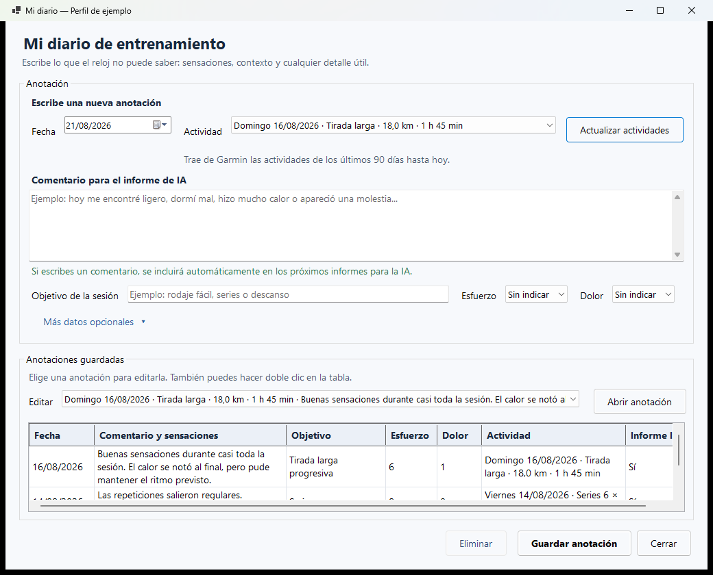

# ExportaGarmin

**Tus datos de Garmin, ordenados y preparados para la IA.**

Aplicación gratuita para Windows que descarga tus datos de Garmin Connect y
crea un archivo ordenado para revisarlo manualmente con ChatGPT, NotebookLM,
Claude u otra IA.


*Ventana principal: revisión semanal recomendada con un perfil de demostración.*


*Creación de un informe para un intervalo concreto, sin datos personales reales.*

Está pensada para preparar una carrera —por ejemplo, una maratón o media
maratón— sin tener que saber programación. La ventana incluye un asistente de
primer uso y una guía corta con la rutina diaria, semanal y mensual.

El programa se conecta a Garmin Connect para descargar tus datos. **No sube
archivos automáticamente a ninguna IA**: tú eliges qué archivo compartes y con
quién.

> [!IMPORTANT]
> ExportaGarmin es un proyecto personal y no oficial: no pertenece a Garmin, no
> está afiliado a Garmin ni cuenta con su respaldo. Utilízalo únicamente con
> tu propia cuenta.

Esta edición parte de
[sirredbeard/garmin-data-export](https://github.com/sirredbeard/garmin-data-export),
mantiene la capa .NET y conserva la licencia Apache 2.0.

Transparencia del proyecto:

- [Política de privacidad](PRIVACY.md)
- [Code signing policy](CODE_SIGNING.md) — solicitud no aprobada por ahora
- [Desinstalación y borrado de datos](UNINSTALL.md)
- [Licencias de terceros](LICENCIAS_TERCEROS.txt)

## Lo más sencillo: instalar y usar

Necesitas Windows 11, conexión a Internet y una cuenta de Garmin Connect.

### 1. Descargar

1. Abre la página
   [Última versión de ExportaGarmin](https://github.com/zarzawan/ExportaGarmin/releases/latest).
2. En **Assets**, descarga `ExportaGarmin-3.7.0-Windows-x64.zip`.
3. No descargues **Source code**: esos enlaces son para programadores.
4. Abre la carpeta **Descargas**.
5. Pulsa con el botón derecho sobre el ZIP y elige **Extraer todo**.
6. Entra en la carpeta extraída.

### 2. Preparar

No necesitas instalar nada más. Asegúrate de haber extraído todo el ZIP,
mantén su contenido junto en la misma carpeta y abre `ExportaGarmin.exe` desde
esa carpeta.

Es posible que Windows muestre un aviso la primera vez. ExportaGarmin es
gratuito: no gano ni pretendo ganar dinero con el programa. SignPath Foundation
no aprobó por ahora la solicitud gratuita porque el proyecto todavía no tiene
suficiente adopción y visibilidad pública. Permitirá volver a solicitarla
cuando el proyecto consiga un reconocimiento más amplio. La versión actual no
está firmada.

Si SignPath acepta una futura solicitud, las versiones firmadas mostrarán
**SignPath Foundation** como editor. Consulta la
[Code signing policy](CODE_SIGNING.md) para comprobar el estado y el alcance
exactos; nunca se afirmará que una versión está firmada antes de verificarla.

Si lo descargaste desde la
[versión oficial](https://github.com/zarzawan/ExportaGarmin/releases/latest),
pulsa **Más información > Ejecutar de todas formas**. No desactives el
antivirus.

<details>
<summary>Comprobación opcional para usuarios avanzados</summary>

La descarga incluye un archivo `.sha256`. Para comprobar su integridad, abre
PowerShell dentro de Descargas y ejecuta:

```powershell
Get-FileHash .\ExportaGarmin-3.7.0-Windows-x64.zip -Algorithm SHA256
```

El resultado debe coincidir con el contenido de
`ExportaGarmin-3.7.0-Windows-x64.zip.sha256`.

</details>

### 3. Abrir por primera vez

1. Haz doble clic en `ExportaGarmin.exe`.
2. Sigue el asistente **Primeros pasos**.
3. Elige un nombre sencillo para tu perfil.
4. Pulsa **Iniciar sesión en Garmin**.
5. Escribe el correo, la contraseña y el MFA únicamente en la ventana negra
   que se abre.
6. Vuelve al asistente y pulsa **Comprobar de nuevo**.
7. Configura tu carrera si ya conoces la distancia y la fecha.

Nunca escribas tu contraseña, MFA, cookies o tokens en un chat, una incidencia
de GitHub o un archivo del proyecto.

### 4. Crear el primer archivo

1. Sincroniza antes el reloj con Garmin Connect.
2. Abre la pestaña **Revisión recomendada**.
3. Deja seleccionado **Texto con JSON (.txt) — recomendado para IA**.
4. Pulsa **Crear archivo para la IA**.
5. Cuando termine, pulsa **Abrir archivo** o **Abrir carpeta**.
6. Sube manualmente el archivo a la IA que prefieras.
7. Pulsa **Copiar pregunta para la IA** y pégala en la conversación.

El panel **Progreso de la exportación** permanece siempre visible y muestra qué
está haciendo el programa. No compartas ese registro sin revisarlo.

El programa propone 16 semanas para maratón y otros objetivos, y 12 para media
maratón. Si todavía no has indicado una carrera, utiliza también 16 semanas.
El archivo nuevo es autocontenido: normalmente puedes sustituir el de la
semana anterior en vez de acumular cientos de archivos.

## Guía integrada

El botón **Guía sencilla** explica el uso sin salir del programa:

- primeros pasos;
- qué conviene hacer cada día;
- revisión semanal;
- revisión mensual;
- privacidad;
- cómo actualizar sin perder perfiles, anotaciones ni caché.

Puedes volver a abrir esa guía en cualquier momento.

## Pregunta preparada para la IA

El botón **Copiar pregunta para la IA** crea una pregunta completa y añade
automáticamente el nombre de la carrera y la fecha final del intervalo
seleccionado. La IA recibe instrucciones para:

- revisar primero el periodo, la cobertura y los datos anómalos o ausentes;
- comparar las últimas cuatro semanas completas con las cuatro anteriores
  solo cuando existan periodos realmente comparables;
- analizar volumen, constancia, tirada larga, intensidad, fuerza,
  recuperación, sensaciones y semanas restantes hasta la carrera;
- distinguir hechos, cálculos e interpretaciones;
- terminar con un máximo de tres mejoras y tres prioridades prudentes.

La respuesta solicitada es breve, sin tablas innecesarias y sin diagnósticos
médicos. Si falta información decisiva, la IA puede formular hasta tres
preguntas concretas.

## Las tres formas de trabajar

### Revisión recomendada

Es el uso normal. Crea una fotografía actual de todo el periodo elegido e
incluye semanas vacías o parciales, actividades, recuperación, sensaciones,
equipamiento, contexto de carrera, calidad de los datos y comparaciones.

Nombres habituales:

```text
revision_maraton_actual.txt
revision_media_maraton_actual.txt
```

Al repetir la revisión se sustituye ese archivo y se evita acumular copias.

### Analizar una actividad

Permite elegir una actividad reciente mediante una referencia privada. Incluye
la máxima resolución temporal disponible, vueltas, zonas, pulso, ritmo o
potencia, autoevaluación, equipamiento y datos del diario asociados.

Garmin puede utilizar grabación inteligente: no se inventa un punto por segundo
si el reloj no lo registró.
El programa solicita hasta 100.000 muestras, suficiente para más de 27 horas
a una muestra por segundo; Garmin decide la resolución que realmente entrega.

### Archivo histórico

Permite elegir una fecha inicial y otra final, ambas incluidas. Es útil para
archivar una temporada o estudiar un periodo diferente. Las series temporales
de todas las actividades son opcionales porque aumentan mucho el tamaño.

Nombre habitual:

```text
garmin_historico_2026-01-01_a_2026-07-29.txt
```

## Qué aporta al análisis de una carrera

El esquema compacto actual es `3.3.1`. Entre otras cosas, prepara:

- una línea temporal por semanas ISO, incluidas semanas sin entrenamiento;
- totales del periodo y cobertura de cada métrica;
- comparación de las últimas cuatro semanas completas con las cuatro
  anteriores;
- tendencias personales de 7 días frente a los 28 anteriores;
- evolución de volumen, frecuencia, tirada larga, desnivel, carga y fuerza;
- título original, altitud, ascenso, descenso y GAP/RAP cuando Garmin los
  proporciona;
- desnivel, altitudes y GAP/RAP de cada vuelta o parcial disponible;
- track GPS completo cuando se solicitan las series y no se elige privacidad
  estricta;
- una sola copia de cada dato deportivo normalizado; los campos nuevos de
  Garmin que todavía no se reconozcan se conservan por campo útil, sin copiar
  de nuevo respuestas completas dentro de `unmapped_sport_data`;
- una única lista de vueltas; los resúmenes de intervalos solo aparecen aparte
  cuando contienen una agrupación deportiva realmente distinta. Desde el
  esquema 3.3.1 se fusionan por tipo, cantidad, distancia y duración, y separan
  el ritmo total del ritmo en movimiento;
- clasificación conservadora de sesiones, indicando la evidencia utilizada;
- exposición al ritmo objetivo a partir de vueltas, si existe un tiempo
  objetivo;
- deriva cardiaca solo cuando la serie tiene duración, estabilidad y cobertura
  suficientes;
- presión arterial, composición corporal, hidratación y nutrición cuando hay
  mediciones reales;
- autoevaluación de Garmin y equipamiento asociado automáticamente. Cada
  actividad guarda solo una referencia; el nombre, fabricante y modelo se
  encuentran una sola vez en la sección global de equipamiento;
- preguntas preparadas para revisiones semanales, mensuales y por actividad;
- calidad de datos, valores ausentes, transformaciones y límites del análisis.

No aplica reglas mágicas de preparación, no convierte ausencias en cero y no
predice lesiones. La IA debe distinguir hechos, cálculos e inferencias. No
sustituye a un entrenador ni a un profesional sanitario.

## Mi carrera

En **Mi carrera** puedes indicar, de forma opcional:

- distancia y fecha;
- objetivo y tiempo deseado;
- experiencia;
- días y minutos disponibles;
- día de tirada larga y fuerza;
- terreno y clima esperado;
- marca reciente;
- limitaciones que deben respetarse.

Estos datos se guardan como información aportada por el usuario y se incluyen
en el archivo para que la IA interprete correctamente el entrenamiento.

## Mi diario

El diario sirve para escribir lo que el reloj no conoce. El comentario ocupa
la parte principal de la ventana y puede incluir sensaciones, contexto del día,
clima, descanso, molestias o cualquier detalle útil para interpretar la sesión.



Al guardar un comentario, se incluye automáticamente en los próximos informes
para la IA. Ya no existe una casilla que haya que recordar marcar. Los
comentarios antiguos que se guardaron expresamente como privados conservan esa
decisión; para incluir uno, ábrelo, revísalo y pulsa **Guardar cambios**.

La pantalla muestra primero solo las opciones más utilizadas:

- actividad, con día de la semana, fecha, nombre, distancia y duración para
  reconocerla fácilmente;
- objetivo de una sesión;
- esfuerzo percibido;
- dolor.

**Más datos opcionales** permite añadir fatiga, motivación, estrés vital, zona
del dolor, nutrición y tolerancia digestiva sin recargar la vista principal.
Las anotaciones guardadas muestran el comentario con varias líneas. Para
editar una, elígela en el desplegable **Editar** y pulsa **Abrir anotación**.
También puedes hacer doble clic sobre su fila. El selector utiliza la fecha,
el nombre de la actividad y un resumen del comentario para que sea fácil
distinguirlas. La cuadrícula también conserva el día de la semana y la fecha
junto a la actividad.

Si falta una sesión reciente, pulsa **Actualizar actividades** dentro del
diario. El programa consulta Garmin y renueva la lista de los últimos 90 días
hasta hoy. Esta acción solo actualiza el catálogo para elegir actividades; no
borra ni cambia las anotaciones guardadas.

La autoevaluación de Garmin sigue siendo la fuente recomendada para esfuerzo y
sensaciones de cada actividad. El diario la complementa, no la sustituye.

## Rutina recomendada

### Cada día

- Sincroniza el reloj con Garmin Connect.
- Después de una sesión importante, completa la autoevaluación de Garmin.
- Usa el diario si quieres añadir contexto que el reloj no conoce. Cualquier
  comentario nuevo se incorporará al informe para la IA.

No hace falta crear un archivo todos los días.

### Cada semana

1. Abre **Revisión recomendada**.
2. Crea el TXT nuevo.
3. Sustituye el anterior en tu conversación o proyecto de IA.
4. Utiliza la pregunta semanal preparada.
5. Decide el entrenamiento con prudencia y teniendo en cuenta tus sensaciones.

### Cada mes

Usa el mismo archivo para pedir una revisión más estratégica:

- evolución del bloque;
- constancia y tirada larga;
- equilibrio de intensidades y fuerza;
- recuperación y calidad del registro;
- prioridades hasta la carrera.

## Texto o Excel

### Texto con JSON `.txt` — recomendado para IA

Es la opción predeterminada. Contiene texto plano con secciones y objetos
JSON, conserva la jerarquía de los datos y se crea con menos trabajo que un
libro de Excel. Es el formato recomendado para subir manualmente a ChatGPT,
NotebookLM u otra IA.

### Excel `.xlsx` — opcional

Está pensado para corredores y entrenadores que quieran revisar los datos de
forma visual, sin conocer JSON ni los nombres técnicos de Garmin. Las fechas,
duraciones, ritmos, distancias y porcentajes son valores reales de Excel; se
pueden ordenar y filtrar sin convertir texto manualmente.

Las pestañas principales aparecen en español y en este orden:

```text
INICIO
RESUMEN
SEMANAS
ACTIVIDADES
INTERVALOS
VUELTAS
ZONAS
SALUD DIARIA
HÁBITOS (solo cuando hay registros)
MEDIDAS
EQUIPAMIENTO
DIARIO
CALIDAD DATOS
AYUDA
```

`INICIO` resume el periodo y el objetivo de carrera. `RESUMEN` muestra los
indicadores principales, una comparación entre bloques de semanas y hasta tres
gráficos. Las demás pestañas utilizan tablas reales de Excel con filtros,
unidades en los encabezados y nombres comprensibles.

Las hojas más anchas muestran al abrir solo las columnas más útiles. Los datos
avanzados siguen dentro del mismo archivo y se pueden desplegar con el símbolo
`+` de Excel. Los registros de carrera o ciclismo de menos de un minuto y menos
de 100 metros se conservan como `Registro muy breve`, pero no cuentan como una
sesión ni alteran las cargas, comparaciones o gráficos del entrenador.

El diario reúne las anotaciones de una misma fecha y actividad en una sola
fila. Si la fecha anotada no coincide con la fecha de Garmin, el Excel muestra
un aviso y conserva ambas fechas para que la persona pueda revisarlas.

No utiliza macros ni fórmulas. Los cálculos proceden del modelo semántico ya
validado y cualquier texto que pudiera interpretarse como fórmula se escapa
antes de escribirlo. Los campos originales y el mapeo de conversiones se
conservan en pestañas ocultas cuyo nombre empieza por `TÉCNICO -`; no estorban
en el uso normal, pero permiten auditar el informe.

Si se solicitan series temporales, aparecen en `DATOS POR SEGUNDO`, oculta por
defecto. Si el intervalo contiene más de 25.000 muestras, se omiten únicamente
del Excel y queda una advertencia en `CALIDAD DATOS`; el TXT conserva todas las
muestras. Para verlas en Excel, utiliza un intervalo más corto o analiza una
actividad por separado.

También se pueden crear ambos formatos, aunque esa opción tarda más. El TXT
continúa siendo el formato recomendado para una IA y conserva exactamente el
modelo semántico aprobado. El Excel es una presentación humana del mismo
modelo y no muestra objetos JSON en sus hojas visibles.

## Privacidad

La explicación completa está en la [política de privacidad](PRIVACY.md).

ExportaGarmin aplica automáticamente una única privacidad recomendada. No hay
que elegir ni configurar nada: retira identidad, contacto, direcciones e
identificadores personales, pero conserva títulos, coordenadas exactas,
ubicaciones deportivas, tracks, polilíneas, altitud, vueltas y métricas.

Las credenciales, contraseñas, MFA, cookies y tokens del almacén de sesión
nunca se incorporan a la exportación.

Los identificadores se sustituyen por referencias privadas estables para cada
perfil, por ejemplo `activity_ref`. Así el diario y las tablas pueden
relacionarse sin publicar el identificador real de Garmin.

Antes de escribir el TXT o Excel se ejecuta una auditoría estructural de
privacidad. `Data Quality` indica la política aplicada, los campos
conservados y eliminados y si se conservaron GPS, títulos, altitud y vueltas.
Los fallos de Garmin se resumen sin copiar mensajes crudos. Si alguna sección falla, el archivo y la ventana indican
**exportación parcial** para evitar conclusiones engañosas.

El nombre visible y el modelo que hayas guardado en Garmin para unas
zapatillas, bicicleta u otro equipo sí se incluyen deliberadamente. Esto
permite distinguir, por ejemplo, unas zapatillas de entrenamiento de un modelo
con placa de carbono. Sus identificadores reales siguen excluidos. Como el
nombre puede ser texto escrito por ti, revísalo antes de compartir el archivo
si contiene información personal. ExportaGarmin no inventa si un modelo lleva
placa: aporta el modelo para que el análisis pueda interpretarlo con prudencia.

La caché sí conserva respuestas originales para no repetir descargas. Nunca
subas la caché, la sesión o el diario a Git.

> [!WARNING]
> Los resultados se guardan dentro de **Documentos**. Si tu carpeta Documentos
> está sincronizada con OneDrive u otro servicio, Windows también puede
> sincronizar las exportaciones. Revisa esa configuración si quieres que
> permanezcan solo en el PC.

## Varias personas en el mismo PC

El botón **Personas** crea perfiles separados. Cada perfil tiene su propia:

- sesión de Garmin;
- caché;
- referencia privada;
- carrera;
- diario;
- carpeta de resultados.

Las exportaciones nunca intentan renovar una sesión con credenciales heredadas
de `.env` o de otra persona. Si una sesión caduca, el programa pide iniciar
sesión expresamente en ese perfil.

Para una separación real frente a otras personas que usan el mismo ordenador,
lo más seguro es crear una cuenta distinta de Windows para cada una.

## Dónde se guarda cada cosa

| Contenido | Ubicación |
|---|---|
| Archivos para la IA | `Documentos\Garmin para IA\NOMBRE_DEL_PERFIL\` |
| Sesión, caché, carrera y diario | `%LOCALAPPDATA%\GarminDataExportLauncher\profiles\` |
| Preferencias y lista de perfiles | `%LOCALAPPDATA%\GarminDataExportLauncher\` |
| Sesión antigua compatible | `%USERPROFILE%\.garminconnect\` |
| Python incluido en la descarga | `runtime\python\` junto a `ExportaGarmin.exe` |

Todo ello queda fuera del repositorio o está cubierto por `.gitignore`.

## Reparar o actualizar

ExportaGarmin comprueba una vez al día si existe una versión nueva. El botón
**Comprobar versión** permite repetir la consulta cuando quieras. Si hay una
actualización, muestra un aviso una sola vez para esa versión y ofrece abrir la
página oficial. El programa no descarga ni instala nada automáticamente.

1. Cierra `ExportaGarmin.exe`.
2. Descarga el ZIP de la nueva versión desde GitHub Releases.
3. Extráelo por completo en una carpeta nueva.
4. Abre el nuevo `ExportaGarmin.exe`.

Los perfiles, sesiones, caché, carreras, diarios y exportaciones se guardan
fuera de la carpeta del programa. Actualizar o sustituir esa carpeta no los
borra.

La comprobación consulta únicamente la última Release pública de GitHub. No
envía a GitHub credenciales, datos de Garmin, anotaciones ni exportaciones. La
conexión sí queda sujeta a la política de GitHub y a los datos técnicos
habituales de una conexión web, como la dirección IP.

`Instalar.bat` se conserva únicamente para desarrolladores que trabajen con
el código fuente. Los usuarios de la versión descargable no deben ejecutarlo.

## Desinstalar y borrar datos

ExportaGarmin es portable. Para quitar solo el programa, ciérralo y elimina la
carpeta que extrajiste del ZIP. Los perfiles y resultados se conservan para que
puedas actualizar sin perderlos.

Si también quieres cerrar sesiones y borrar perfiles, cachés, diario y
exportaciones, sigue la guía completa de
[desinstalación y borrado de datos](UNINSTALL.md). Revisa siempre el contenido
antes de eliminarlo, especialmente si Documentos se sincroniza con OneDrive.

## Problemas frecuentes

### Falta iniciar sesión

Pulsa **Iniciar sesión**, completa el acceso en la ventana negra y después
pulsa **Comprobar**. Si la sesión caducó, repite el proceso en el perfil
correcto.

### Garmin limita las solicitudes

Espera unos minutos y vuelve a ejecutar. La caché permite continuar sin repetir
lo ya descargado.

### El archivo indica exportación parcial

Consulta el panel **Progreso de la exportación**, que permanece visible. El
archivo sigue siendo utilizable, pero una o más secciones no terminaron.
Repite más tarde si esos datos son importantes.

### No aparecen sueño, VFC o presión arterial

El programa no inventa mediciones. Consulta `CALIDAD_DATOS` para distinguir
entre ausencia real, falta de cobertura y error de descarga.

### No encuentro el archivo

Pulsa **Abrir carpeta**. Recuerda que Windows puede redirigir Documentos a
OneDrive.

## Uso técnico por línea de comandos

La aplicación gráfica .NET es la opción recomendada. Para consultar todas las
opciones:

```powershell
dotnet run -- --help
```

Iniciar sesión tradicional:

```powershell
dotnet run -- --login
```

Revisión de 16 semanas en el TXT recomendado:

```powershell
dotnet run -- --report preparation --review-weeks 16 --format txt
```

Intervalo explícito compacto:

```powershell
dotnet run -- --start-date 2026-01-01 --end-date 2026-07-29 --compact
```

Historial completo original, sin transformar:

```powershell
dotnet run -- --all
```

El modo completo conserva respuestas originales y puede contener muchos más
datos privados. No es el recomendado para subir a una IA.

## Desarrollo y comprobaciones

Para trabajar con el código fuente se necesitan Python 3.11 y el SDK de
.NET 10 LTS. `Instalar.bat` prepara ese entorno técnico y compila
`ExportaGarmin.exe`; no forma parte de la instalación normal de una Release.

```powershell
.\.venv\Scripts\python.exe -m unittest discover -s tests -v
dotnet restore GarminDataExport.slnx
dotnet build GarminDataExport.slnx --no-restore
```

Crear localmente la misma descarga portable que publica GitHub:

```powershell
.\scripts\Build-PortableRelease.ps1 -Version 3.7.0
```

El resultado queda en `artifacts\` e incluye el ZIP y su SHA-256. GitHub
Actions ejecuta las pruebas y genera estos archivos automáticamente al
publicar una etiqueta de versión.

Dependencias principales:

- `garminconnect` y `garth` para Garmin Connect;
- `tzdata` para zonas horarias IANA en Windows;
- `openpyxl` para crear XLSX sin macros;
- Python 3.11;
- .NET 10 LTS.

Garmin no ofrece una API personal oficial. Sus endpoints pueden cambiar y sus
límites de llamadas no están documentados.

## Licencia y atribución

Licencia Apache 2.0. Consulta [LICENSE](LICENSE).

Proyecto original:
[sirredbeard/garmin-data-export](https://github.com/sirredbeard/garmin-data-export).

ExportaGarmin conserva el historial Git común con el proyecto original y no
oculta esta procedencia, aunque GitHub no muestre actualmente el repositorio
como un fork formal. El backend Python y la consola .NET comenzaron en el
proyecto original; el lanzador gráfico, los perfiles, los informes para IA, el
diario, la privacidad automática, el Excel y el paquete portable se mantienen
en este repositorio.

El proyecto es gratuito y no tiene publicidad, suscripciones, afiliados,
telemetría ni finalidad comercial.

Esta edición se distribuye sin garantía. Revisa siempre los datos y protege tus
archivos de salud.
