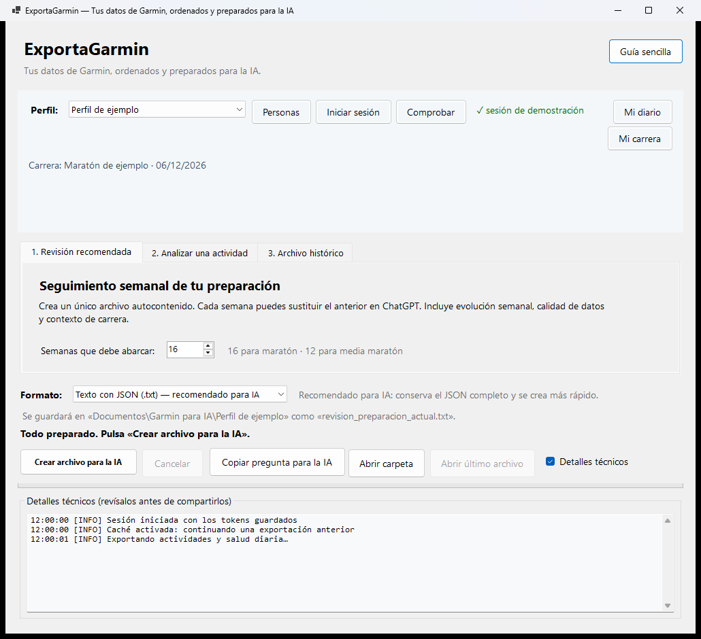
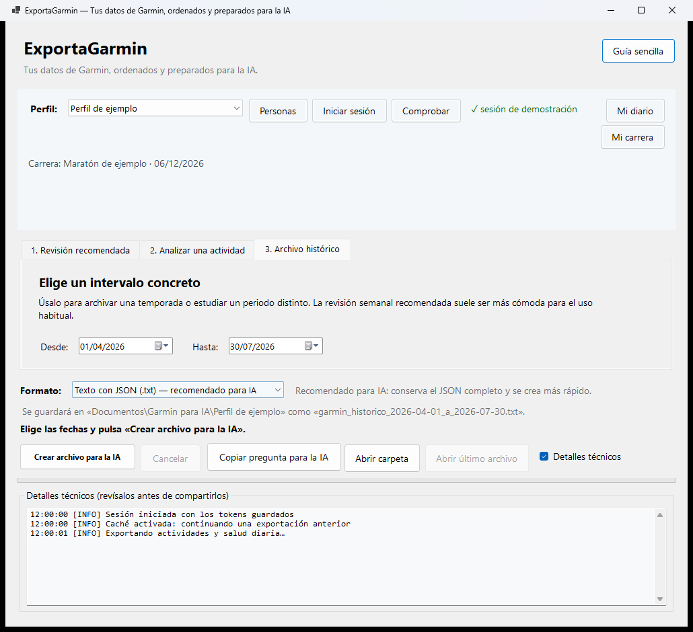

# ExportaGarmin

**Tus datos de Garmin, ordenados y preparados para la IA.**

Aplicación gratuita para Windows que descarga tus datos de Garmin Connect y
crea un archivo ordenado para revisarlo manualmente con ChatGPT, NotebookLM,
Claude u otra IA.



*Ventana principal: revisión semanal recomendada con un perfil de demostración.*



*Creación de un informe para un intervalo concreto, sin datos personales reales.*

Está pensada para preparar una carrera —por ejemplo, una maratón o media
maratón— sin tener que saber programación. La ventana incluye un asistente de
primer uso y una guía corta con la rutina diaria, semanal y mensual.

El programa se conecta a Garmin Connect para descargar tus datos. **No sube
archivos automáticamente a ninguna IA**: tú eliges qué archivo compartes y con
quién.

> [!IMPORTANT]
> ExportaGarmin es un proyecto personal y no oficial: no pertenece a Garmin, no
> está afiliado a Garmin ni cuenta con su respaldo. Utilízalo únicamente con
> tu propia cuenta.

Esta edición parte de
[sirredbeard/garmin-data-export](https://github.com/sirredbeard/garmin-data-export),
mantiene la capa .NET y conserva la licencia Apache 2.0.

## Lo más sencillo: instalar y usar

Necesitas Windows 11, conexión a Internet y una cuenta de Garmin Connect.

### 1. Descargar

1. Abre la página
   [Última versión de ExportaGarmin](https://github.com/zarzawan/ExportaGarmin/releases/latest).
2. En **Assets**, descarga `ExportaGarmin-3.3.1-Windows-x64.zip`.
3. No descargues **Source code**: esos enlaces son para programadores.
4. Abre la carpeta **Descargas**.
5. Pulsa con el botón derecho sobre el ZIP y elige **Extraer todo**.
6. Entra en la carpeta extraída.

### 2. Preparar

No necesitas instalar nada más. Asegúrate de haber extraído todo el ZIP,
mantén su contenido junto en la misma carpeta y abre `ExportaGarmin.exe` desde
esa carpeta.

Es posible que Windows muestre un aviso la primera vez. ExportaGarmin es
gratuito: no gano ni pretendo ganar dinero con el programa. Para reducir este
tipo de avisos tendría que comprar y renovar un certificado comercial, y ese
gasto no forma parte del objetivo de este proyecto personal y gratuito.

Si lo descargaste desde la
[versión oficial](https://github.com/zarzawan/ExportaGarmin/releases/latest),
pulsa **Más información > Ejecutar de todas formas**. No desactives el
antivirus.

<details>
<summary>Comprobación opcional para usuarios avanzados</summary>

La descarga incluye un archivo `.sha256`. Para comprobar su integridad, abre
PowerShell dentro de Descargas y ejecuta:

```powershell
Get-FileHash .\ExportaGarmin-3.3.1-Windows-x64.zip -Algorithm SHA256
```

El resultado debe coincidir con el contenido de
`ExportaGarmin-3.3.1-Windows-x64.zip.sha256`.

</details>

### 3. Abrir por primera vez

1. Haz doble clic en `ExportaGarmin.exe`.
2. Sigue el asistente **Primeros pasos**.
3. Elige un nombre sencillo para tu perfil.
4. Pulsa **Iniciar sesión en Garmin**.
5. Escribe el correo, la contraseña y el MFA únicamente en la ventana negra
   que se abre.
6. Vuelve al asistente y pulsa **Comprobar de nuevo**.
7. Configura tu carrera si ya conoces la distancia y la fecha.

Nunca escribas tu contraseña, MFA, cookies o tokens en un chat, una incidencia
de GitHub o un archivo del proyecto.

### 4. Crear el primer archivo

1. Sincroniza antes el reloj con Garmin Connect.
2. Abre la pestaña **Revisión recomendada**.
3. Deja seleccionado **Texto con JSON (.txt) — recomendado para IA**.
4. Pulsa **Crear archivo para la IA**.
5. Cuando termine, pulsa **Abrir archivo** o **Abrir carpeta**.
6. Sube manualmente el archivo a la IA que prefieras.
7. Pulsa **Copiar pregunta para la IA** y pégala en la conversación.

**Detalles técnicos** aparece activado para que puedas ver el progreso. Puedes
ocultarlo si no lo necesitas; no compartas ese registro sin revisarlo.

El programa propone 16 semanas para maratón y otros objetivos, y 12 para media
maratón. Si todavía no has indicado una carrera, utiliza también 16 semanas.
El archivo nuevo es autocontenido: normalmente puedes sustituir el de la
semana anterior en vez de acumular cientos de archivos.

## Guía integrada

El botón **Guía sencilla** explica el uso sin salir del programa:

- primeros pasos;
- qué conviene hacer cada día;
- revisión semanal;
- revisión mensual;
- privacidad.

Puedes volver a abrir esa guía en cualquier momento.

## Pregunta preparada para la IA

El botón **Copiar pregunta para la IA** crea una pregunta completa y añade
automáticamente el nombre de la carrera y la fecha final del intervalo
seleccionado. La IA recibe instrucciones para:

- revisar primero el periodo, la cobertura y los datos anómalos o ausentes;
- comparar las últimas cuatro semanas completas con las cuatro anteriores
  solo cuando existan periodos realmente comparables;
- analizar volumen, constancia, tirada larga, intensidad, fuerza,
  recuperación, sensaciones y semanas restantes hasta la carrera;
- distinguir hechos, cálculos e interpretaciones;
- terminar con un máximo de tres mejoras y tres prioridades prudentes.

La respuesta solicitada es breve, sin tablas innecesarias y sin diagnósticos
médicos. Si falta información decisiva, la IA puede formular hasta tres
preguntas concretas.

## Las tres formas de trabajar

### Revisión recomendada

Es el uso normal. Crea una fotografía actual de todo el periodo elegido e
incluye semanas vacías o parciales, actividades, recuperación, sensaciones,
equipamiento, contexto de carrera, calidad de los datos y comparaciones.

Nombres habituales:

```text
revision_maraton_actual.txt
revision_media_maraton_actual.txt
```

Al repetir la revisión se sustituye ese archivo y se evita acumular copias.

### Analizar una actividad

Permite elegir una actividad reciente mediante una referencia privada. Incluye
la máxima resolución temporal disponible, vueltas, zonas, pulso, ritmo o
potencia, autoevaluación, equipamiento y datos del diario asociados.

Garmin puede utilizar grabación inteligente: no se inventa un punto por segundo
si el reloj no lo registró.
El programa solicita hasta 100.000 muestras, suficiente para más de 27 horas
a una muestra por segundo; Garmin decide la resolución que realmente entrega.

### Archivo histórico

Permite elegir una fecha inicial y otra final, ambas incluidas. Es útil para
archivar una temporada o estudiar un periodo diferente. Las series temporales
de todas las actividades son opcionales porque aumentan mucho el tamaño.

Nombre habitual:

```text
garmin_historico_2026-01-01_a_2026-07-29.txt
```

## Qué aporta al análisis de una carrera

El esquema compacto actual es `3.1.0`. Entre otras cosas, prepara:

- una línea temporal por semanas ISO, incluidas semanas sin entrenamiento;
- totales del periodo y cobertura de cada métrica;
- comparación de las últimas cuatro semanas completas con las cuatro
  anteriores;
- tendencias personales de 7 días frente a los 28 anteriores;
- evolución de volumen, frecuencia, tirada larga, desnivel, carga y fuerza;
- clasificación conservadora de sesiones, indicando la evidencia utilizada;
- exposición al ritmo objetivo a partir de vueltas, si existe un tiempo
  objetivo;
- deriva cardiaca solo cuando la serie tiene duración, estabilidad y cobertura
  suficientes;
- presión arterial, composición corporal, hidratación y nutrición cuando hay
  mediciones reales;
- autoevaluación de Garmin y equipamiento asociado automáticamente, con su
  nombre, fabricante y modelo;
- preguntas preparadas para revisiones semanales, mensuales y por actividad;
- calidad de datos, valores ausentes, transformaciones y límites del análisis.

No aplica reglas mágicas de preparación, no convierte ausencias en cero y no
predice lesiones. La IA debe distinguir hechos, cálculos e inferencias. No
sustituye a un entrenador ni a un profesional sanitario.

## Mi carrera

En **Mi carrera** puedes indicar, de forma opcional:

- distancia y fecha;
- objetivo y tiempo deseado;
- experiencia;
- días y minutos disponibles;
- día de tirada larga y fuerza;
- terreno y clima esperado;
- marca reciente;
- limitaciones que deben respetarse.

Estos datos se guardan como información aportada por el usuario y se incluyen
en el archivo para que la IA interprete correctamente el entrenamiento.

## Mi diario

El diario sirve para añadir únicamente lo que el reloj no conoce:

- objetivo de una sesión;
- esfuerzo percibido;
- fatiga, motivación y estrés vital;
- dolor y zona;
- carbohidratos, líquido y sodio por hora;
- tolerancia digestiva;
- comentario opcional.

El comentario permanece local por defecto. Solo entra en la exportación si
marcas expresamente **Incluir comentario en el archivo para la IA**. Las
entradas se pueden eliminar desde el propio diario.

La autoevaluación de Garmin sigue siendo la fuente recomendada para esfuerzo y
sensaciones de cada actividad. El diario la complementa, no la sustituye.

## Rutina recomendada

### Cada día

- Sincroniza el reloj con Garmin Connect.
- Después de una sesión importante, completa la autoevaluación de Garmin.
- Usa el diario solo si quieres añadir contexto que el reloj no conoce.

No hace falta crear un archivo todos los días.

### Cada semana

1. Abre **Revisión recomendada**.
2. Crea el TXT nuevo.
3. Sustituye el anterior en tu conversación o proyecto de IA.
4. Utiliza la pregunta semanal preparada.
5. Decide el entrenamiento con prudencia y teniendo en cuenta tus sensaciones.

### Cada mes

Usa el mismo archivo para pedir una revisión más estratégica:

- evolución del bloque;
- constancia y tirada larga;
- equilibrio de intensidades y fuerza;
- recuperación y calidad del registro;
- prioridades hasta la carrera.

## Texto o Excel

### Texto con JSON `.txt` — recomendado para IA

Es la opción predeterminada. Contiene texto plano con secciones y objetos
JSON, conserva la jerarquía de los datos y se crea con menos trabajo que un
libro de Excel. Es el formato recomendado para subir manualmente a ChatGPT,
NotebookLM u otra IA.

### Excel `.xlsx` — opcional

Está pensado principalmente para quien quiera abrir los datos como tablas.
También puede utilizarse con una IA, pero tarda más en generarse y no aporta
una ventaja general frente al TXT con JSON.

Contiene tablas estáticas fáciles de revisar:

```text
LEEME
CONTEXTO_CARRERA
RESUMEN
SEMANAS
DIAS
ACTIVIDADES
VUELTAS
ZONAS
ACTIVIDAD_EQUIPAMIENTO
SERIES_DESCRIPTORES
SERIES_ACTIVIDAD
EQUIPAMIENTO
DIARIO
PRESION_ARTERIAL
COMPOSICION
METRICAS_GARMIN
CALIDAD_DATOS
DICCIONARIO
```

No utiliza macros. Los valores que podrían interpretarse como fórmulas se
escapan antes de escribirlos.

`SERIES_ACTIVIDAD` conserva las muestras detalladas cuando se activa esa
opción para una actividad. `SERIES_DESCRIPTORES` explica el significado y la
unidad de cada columna. El libro se escribe de forma progresiva para reducir
el tiempo y la memoria utilizados. Si el intervalo contiene más de 25.000
muestras, las series se omiten únicamente del Excel y queda una advertencia
en `LEEME` y `CALIDAD_DATOS`; el TXT conserva todas las muestras. Para verlas
en Excel, utiliza un intervalo más corto o analiza una actividad por separado.

También se pueden crear ambos formatos, aunque esa opción tarda más.

## Privacidad

El modo compacto predeterminado intenta excluir:

- nombre y datos identificativos del propietario;
- identificadores reales de actividades, usuario, perfil, dispositivos y
  equipamiento;
- números de serie;
- coordenadas, polilíneas y ubicaciones;
- títulos y horas exactas de actividades;
- URL, imágenes, cookies, tokens y credenciales;
- hábitos íntimos y estructuras duplicadas.

Los identificadores se sustituyen por referencias privadas estables para cada
perfil, por ejemplo `activity_ref`. Así el diario y las tablas pueden
relacionarse sin publicar el identificador real de Garmin.

Antes de escribir el TXT o Excel se ejecuta una auditoría estructural de
privacidad. Los fallos de Garmin se resumen sin copiar respuestas, URL o
mensajes crudos. Si alguna sección falla, el archivo y la ventana indican
**exportación parcial** para evitar conclusiones engañosas.

El nombre visible y el modelo que hayas guardado en Garmin para unas
zapatillas, bicicleta u otro equipo sí se incluyen deliberadamente. Esto
permite distinguir, por ejemplo, unas zapatillas de entrenamiento de un modelo
con placa de carbono. Sus identificadores reales siguen excluidos. Como el
nombre puede ser texto escrito por ti, revísalo antes de compartir el archivo
si contiene información personal. ExportaGarmin no inventa si un modelo lleva
placa: aporta el modelo para que el análisis pueda interpretarlo con prudencia.

La caché sí conserva respuestas originales para no repetir descargas. Nunca
subas la caché, la sesión o el diario a Git.

> [!WARNING]
> Los resultados se guardan dentro de **Documentos**. Si tu carpeta Documentos
> está sincronizada con OneDrive u otro servicio, Windows también puede
> sincronizar las exportaciones. Revisa esa configuración si quieres que
> permanezcan solo en el PC.

## Varias personas en el mismo PC

El botón **Personas** crea perfiles separados. Cada perfil tiene su propia:

- sesión de Garmin;
- caché;
- referencia privada;
- carrera;
- diario;
- carpeta de resultados.

Las exportaciones nunca intentan renovar una sesión con credenciales heredadas
de `.env` o de otra persona. Si una sesión caduca, el programa pide iniciar
sesión expresamente en ese perfil.

Para una separación real frente a otras personas que usan el mismo ordenador,
lo más seguro es crear una cuenta distinta de Windows para cada una.

## Dónde se guarda cada cosa

| Contenido | Ubicación |
|---|---|
| Archivos para la IA | `Documentos\Garmin para IA\NOMBRE_DEL_PERFIL\` |
| Sesión, caché, carrera y diario | `%LOCALAPPDATA%\GarminDataExportLauncher\profiles\` |
| Preferencias y lista de perfiles | `%LOCALAPPDATA%\GarminDataExportLauncher\` |
| Sesión antigua compatible | `%USERPROFILE%\.garminconnect\` |
| Python incluido en la descarga | `runtime\python\` junto a `ExportaGarmin.exe` |

Todo ello queda fuera del repositorio o está cubierto por `.gitignore`.

## Reparar o actualizar

1. Cierra `ExportaGarmin.exe`.
2. Descarga el ZIP de la nueva versión desde GitHub Releases.
3. Extráelo por completo en una carpeta nueva.
4. Abre el nuevo `ExportaGarmin.exe`.

Los perfiles, sesiones, caché, carreras, diarios y exportaciones se guardan
fuera de la carpeta del programa. Actualizar o sustituir esa carpeta no los
borra.

`Instalar.bat` se conserva únicamente para desarrolladores que trabajen con
el código fuente. Los usuarios de la versión descargable no deben ejecutarlo.

## Problemas frecuentes

### Falta iniciar sesión

Pulsa **Iniciar sesión**, completa el acceso en la ventana negra y después
pulsa **Comprobar**. Si la sesión caducó, repite el proceso en el perfil
correcto.

### Garmin limita las solicitudes

Espera unos minutos y vuelve a ejecutar. La caché permite continuar sin repetir
lo ya descargado.

### El archivo indica exportación parcial

Abre **Detalles técnicos**. El archivo sigue siendo utilizable, pero una o más
secciones no terminaron. Repite más tarde si esos datos son importantes.

### No aparecen sueño, VFC o presión arterial

El programa no inventa mediciones. Consulta `CALIDAD_DATOS` para distinguir
entre ausencia real, falta de cobertura y error de descarga.

### No encuentro el archivo

Pulsa **Abrir carpeta**. Recuerda que Windows puede redirigir Documentos a
OneDrive.

## Uso técnico por línea de comandos

La aplicación gráfica .NET es la opción recomendada. Para consultar todas las
opciones:

```powershell
dotnet run -- --help
```

Iniciar sesión tradicional:

```powershell
dotnet run -- --login
```

Revisión de 16 semanas en el TXT recomendado:

```powershell
dotnet run -- --report preparation --review-weeks 16 --format txt
```

Intervalo explícito compacto:

```powershell
dotnet run -- --start-date 2026-01-01 --end-date 2026-07-29 --compact
```

Historial completo original, sin transformar:

```powershell
dotnet run -- --all
```

El modo completo conserva respuestas originales y puede contener muchos más
datos privados. No es el recomendado para subir a una IA.

## Desarrollo y comprobaciones

Para trabajar con el código fuente se necesitan Python 3.11 y el SDK de
.NET 10 LTS. `Instalar.bat` prepara ese entorno técnico y compila
`ExportaGarmin.exe`; no forma parte de la instalación normal de una Release.

```powershell
.\.venv\Scripts\python.exe -m unittest discover -s tests -v
dotnet restore GarminDataExport.slnx
dotnet build GarminDataExport.slnx --no-restore
```

Crear localmente la misma descarga portable que publica GitHub:

```powershell
.\scripts\Build-PortableRelease.ps1 -Version 3.3.1
```

El resultado queda en `artifacts\` e incluye el ZIP y su SHA-256. GitHub
Actions ejecuta las pruebas y genera estos archivos automáticamente al
publicar una etiqueta de versión.

Dependencias principales:

- `garminconnect` y `garth` para Garmin Connect;
- `tzdata` para zonas horarias IANA en Windows;
- `openpyxl` para crear XLSX sin macros;
- Python 3.11;
- .NET 10 LTS.

Garmin no ofrece una API personal oficial. Sus endpoints pueden cambiar y sus
límites de llamadas no están documentados.

## Licencia y atribución

Licencia Apache 2.0. Consulta [LICENSE](LICENSE).

Proyecto original:
[sirredbeard/garmin-data-export](https://github.com/sirredbeard/garmin-data-export).

Esta edición se distribuye sin garantía. Revisa siempre los datos y protege tus
archivos de salud.
